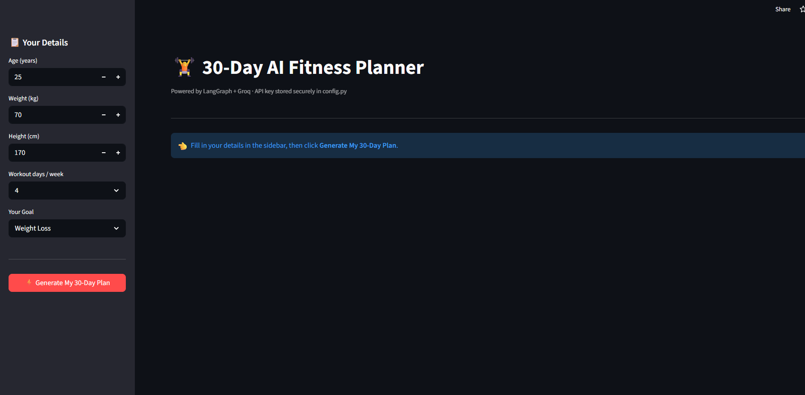

# 🏋️ 30-Day AI Fitness Planner

Powered by LangGraph and Groq, this application generates hyper-personalized, state-aware 30-day diet and workout plans. It enforces complex business logic—like correct metabolic math, diverse meal selection, and progressive overload in training—all presented in an intuitive Streamlit dashboard.

---

## 📸 Application Preview

<p align="center">
  
</p>

---

## 🧠 Core Architecture (Agentic Workflow)

Unlike simple, sequential LLM chains, this planner utilizes a **StateGraph** orchestrator. This allows for a stateful workflow, where data (like BMI, calculated metrics, and calorie targets) is carried forward reliably between different processing nodes.

### Pipeline Flow:

1.  **Node 1: `calc_metrics` (State Update)**:
    * Accepts user input (Age, Weight, Height, Goal).
    * Calculates BMI and TDEE (Total Daily Energy Expenditure) in Python.
    * Determines the target calorie goal (Surplus or Deficit).
    * Updates the global `State` TypedDict.

2.  **Node 2: `gen_diet` (Groq Inference)**:
    * Uses the updated `State` data (calories, goal) to prompt an LLM.
    * Instructs the LLM to generate a 30-day, diverse meal plan as a structured JSON object.

3.  **Node 3: `gen_workout` (Groq Inference)**:
    * Uses the `State` data (goal, days/week) to prompt an LLM.
    * Enforces "Progressive Overload" in the prompt engineering (Week 2 harder than Week 1, etc.).
    * Returns a 30-day training regimen as a structured JSON object.

4.  **Node 4: `gen_summary` (Groq Inference)**:
    * Wraps the calculated metrics and plan overviews into a motivating, human-friendly narrative.

5.  **End Node**: Presents the consolidated plan in the Streamlit UI.

---

## 🛠️ Technical Stack

* **Orchestration:** [LangGraph](https://github.com/langchain-ai/langgraph) (via `StateGraph`) for complex, multi-step workflow management.
* **AI Model:** [Groq](https://groq.com/) (using fast LLaMA models) for ultra-responsive, complex token generation.
* **Data Structures:** LangChain Core `HumanMessage` objects for standardized LLM interaction.
* **User Interface:** [Streamlit](https://streamlit.io/) for a reactive, professional, and dark-themed web interface.
* **Programming Language:** Python, utilizing `TypedDict` for clean, reliable state management across nodes.

---

## ⚙️ Project Structure

```text
ai-fitness-planner/
├── app.py           # The main Streamlit user interface and page logic.
├── graph.py         # The LangGraphStateGraph workflow and node definitions.
├── prompts.py       # Centrally managed LLM prompts with strict formatting rules.
├── config.py.example # TEMPLATE for API keys (COPY THIS and remove .example).
├── README.md        # Project documentation.
├── .gitignore       # Prevents sensitive files (like config.py) from being tracked.
└── (image_0.png)    # (Ensure you add your preview image to the repo and update the path above).
